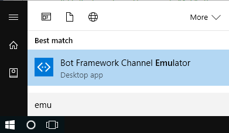
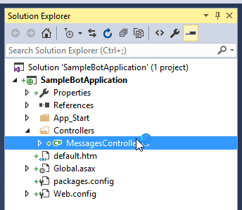
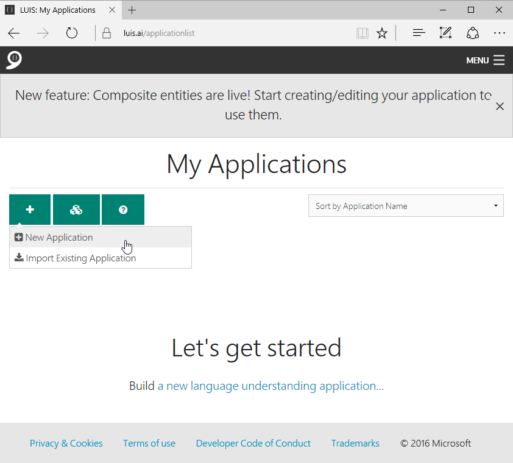
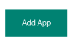

# Microsoft Bot - How to build your own personal assistant

Bots are personal assistants. The best spots out there make you feel like a director, like someone who is getting help from an external entity.

The use cases for bots are enormous. It is possible to interact verbally and direct the behavior of an external entity, doing such things as booking airline flights, searching for news on the Internet, and more.

The bots you can be sophisticated and are able to perform multi-step operations. What makes these bots really compelling is that they can live outside the constraints of a single device and travel through the various systems you might have in place.

A lot of information can be packed into a question, information that would normally occupy a number of fields in a web page or application. Imagine, "Find me a flight from San Francisco to Seattle between 10am and 2pm on August 11th."

## What is the core of Microsoft Bot?

From a technical point of view, bots are composed of two components.

A bot is first a Microsoft-operated service plus a framework or SDK that a developer can use to build bots.

Bots, by themselves, have little value. To be really useful they will leverage other service and SDKs:
- LUIS (Language Understanding and Intelligence Service)
- Speech APIs
- Azure
- And much more...

#### The SDK provides a lot of difficult to code capabilities

Managing state in a conversation is difficult. Keeping track of what was said, the past steps in a multi-step workflow is maintained by the Bot SDK.

## Starting your work

Let's begin our work by installing the Bot SDK and creating a new project in Visual Studio.

This link here provide some pretty good starting documentation:

[https://docs.botframework.com/en-us/](https://docs.botframework.com/en-us/)

#### Installing the Bot SDK

- Download link
	- [http://aka.ms/bf-bc-vstemplate](http://aka.ms/bf-bc-vstemplate)
- Where you will save the zip file
	- %USERPROFILE%\Documents\Visual Studio 2015\Templates\ProjectTemplates\Visual C#\

_Figure 1:  Saving the zip/template file into the correct Visual Studio folder_
Bot

#### Installing the Bot framework emulator

In order to debug things properly, you will need the bot framework emulator, which can be downloaded here:

https://download.botframework.com/botconnector/tools/emulator/publish.htm

Click "install."

_Figure 2:  Installing the bot emulator framework_

Click "install" again.

_Figure 3:  Application Install_

The emulator will appear. As you can see by the red box we should perhaps upgrade to the new version by clicking on "here."

_Figure 4:  The Bot Emulator_

#### Getting started with the Bot Connector

This represents another way to actually install the bot connector.

https://docs.botframework.com/en-us/csharp/builder/sdkreference/gettingstarted.html

_Figure 5:  Nuget Package Manager_

_Figure 6:  Installing Bot Builder_

#### Creating a bot project in Visual Studio

Now that we have the proper template files in place, let's go ahead now and create a new **Microsoft Bot** project. Select "File/New" from the menu.

_Figure 7:  Creating a new project_

The project type we are looking for is **Microsoft Bot.**

_Figure 8:  Choosing "Bot Application" and providing a name (SampleBotApplication)_

A pre-configured Bot project will result I seen here by the **Solution Explorer**.

_Figure 9:  What the finished product looks like_

## Running the solution (Bot Project)

As is, the solution is ready to run. The caveat, of course, is that it's not doing anything very interesting - yet.

My default browser is Microsoft Edge and so just click on that button in the toolbar or hit the F5 key.

_Figure 10: Running the bot_

After you finish upgrading the emulator, you will need to stop and restart Visual Studio as explained previously.

Once the project is running and you see the webpage show up, you are ready to start the emulator. Go ahead and hit the Windows button and select emulator as seen below:

Your port number may be different.

_Figure 11: The browser experience after running the solution_

_Figure 12:  Starting the Bot emulator_

_Figure 13:  Testing your app in the Bot Emulator_

#### Understanding the JSON

One of the things you'll notice is that JSON strings are sent back and forth providing the context of the interaction between the end-user and the Bot. 

Notice for example, the following properties of the JSON interaction:

- type
- timestamp
- from
- conversation
- recipient
- text
- replytoid

As you recall, a default project was created. Notice that all that the boiler plate example provided for us was an echo back up whatever text we typed in, as well as adding the number of characters or the length of the string that the user typed in.

## Enhancing the default project to do something more useful

At this point, we have walked through much of the process required to understand deeper challenges, such as adding language recognition to the bot. Let's explore other possibilities here with the idea that there is a huge variety of Bots that we can create.

The core of the functionality is buried in the file called **MessagesController.cs.**

_Figure 14:  MessagesController.cs_

Let's take a look at the code that was generated. notice that the **Post()** method gets called anytime our code receives a message and must reply to it. You can think of this is the entry point for the Bot application, whenever the user interacts with the bot.

_Figure 15:  The "Post" method_

The logic is simple. If the user interacts with our bot by sending a message,  the if statement you see below will be true and therefore the message will get processed.

	public async Task<HttpResponseMessage> Post([FromBody]Activity activity)
	{
        // If the user sends an activity type of "Message", then measure the string length
        // and respond back with the original text that was sent along with the length
	    if (activity.Type == ActivityTypes.Message)
	    {
	        ConnectorClient connector = new ConnectorClient(new Uri(activity.ServiceUrl));
	        // calculate something for us to return
	        int length = (activity.Text ?? string.Empty).Length;
	
	        // return our reply to the user
	        Activity reply = activity.CreateReply($"You sent {activity.Text} which was {length} characters");
	        await connector.Conversations.ReplyToActivityAsync(reply);
	    }
	    else
	    {
	        HandleSystemMessage(activity);
	    }
	    var response = Request.CreateResponse(HttpStatusCode.OK);
	    return response;
	}

#### Adding LUIS support

LUIS is a Language Understanding Intelligent Service. You can enable your bot to understand human commands with it.

To begin, you need to register a new application.

[https://www.luis.ai/](https://www.luis.ai/)

Fill in:

- Country
- Organization
- And the rest

_Figure 16:  Signing up with LUIS_

Select "New Application."

_Figure 17:  Adding a New Application_

Fill in "Application Name" and "Usage Scenario."

_Figure 18:  Specifying Application details_

Scroll to bottom and choose "Add App."

_Figure 19:  Scroll to bottom to "Add App"_

After a few moments, add a new "Entity." We are doing a search for products. So think of "entity" as "laptop" and "Intent" as "Product".

You will need to add "Entities" through the portal. Entities represent the main conceptual aspects or search keywords of your LUIS-based application. In our case, the "entity" will be "laptop." Think of an "entity" of a product we wish to find the price for.  The next key point to make is "Intents." In our case, the intent will be "product." An example of a "product" is a "laptop." "Intent" in this case represents what we desire to find the price for.

Just to be clear, our "Entity" will be "laptop" and our "intent" will be "product."

_Figure 102:  x_

_Figure 103:  x_

_Figure 104:  x_

http://www.c-sharpcorner.com/article/an-interactive-bot-application-with-luis-using-microsoft-bot/

https://dev.botframework.com/bots?id=PriceFinderBot

- App Name
	- PricingBot
- AppId 
	- c659cfea-dd85-4f12-9e14-2e49e41332de
- Messaging Endpoint
	- http://pricingbot.azurewebsites.net/
- Password
	- Mqj9z09TQKF7pwajGggVJJv
- Bot registration
	- https://dev.botframework.com/bots?id=PriceFinderBot
- Getting started
	- https://docs.botframework.com/en-us/csharp/builder/sdkreference/gettingstarted.html
